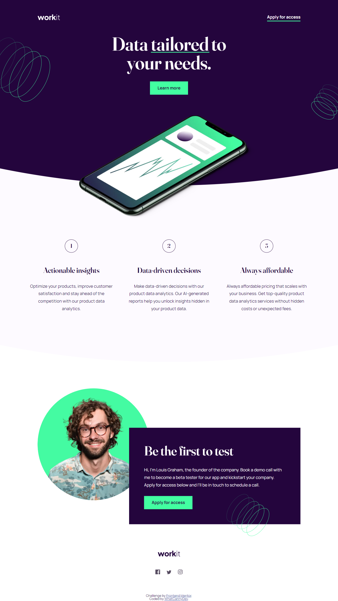

# Frontend Mentor - Workit landing page solution

This is a solution to the [Workit landing page challenge on Frontend Mentor](https://www.frontendmentor.io/challenges/workit-landing-page-2fYnyle5lu). Frontend Mentor challenges help you improve your coding skills by building realistic projects. 

## Table of contents

- [Overview](#overview)
  - [The challenge](#the-challenge)
  - [Screenshot](#screenshot)
  - [Links](#links)
- [My process](#my-process)
  - [Built with](#built-with)
  - [What I learned](#what-i-learned)
  - [Continued development](#continued-development)
  - [Useful resources](#useful-resources)
- [Author](#author)

## Overview

### The challenge

Your challenge is to build out this landing page and get it looking as close to the design as possible.

You can use any tools you like to help you complete the challenge. So if you've got something you'd like to practice, feel free to give it a go.

Users should be able to:

- View the optimal layout for the interface depending on their device's screen size
- See hover and focus states for all interactive elements on the page

### Screenshot

### Links

- Solution Repository URL: [Add solution URL here](https://github.com/CannyRo/FrontendMentor_WorkitLandingPage_2fYnyle5lu)
- Live Site URL: [Add live site URL here](https://cannyro.github.io/FrontendMentor_WorkitLandingPage_2fYnyle5lu/)

## My process

### Built with

- Semantic HTML5 markup
- CSS custom properties
- Flexbox
- Mobile-first workflow

### What I learned

I learned a little more about variable font management and sweated over the curves of the different backgrounds and the display of background patterns. 

### Continued development

Not to spread myself too thin and try to find the right way of doing things more quickly. I spent a lot of time doing/undoing things before arriving at this satisfying result (not perfect, but satisfying all the same).

### Useful resources

- [How styling with variable font](https://fonts.google.com/knowledge/using_type/styling_type_on_the_web_with_variable_fonts) - This helped me for the Fraunces 144pt font.
- [How to Make Curved Header using Html5 and CSS3](https://www.example.com) - This is an amazing short video which helped me finally understand how to styling with curves.

## Author

- Website - [WhatCannyDev is searching a work-study contract in France](https://cannyro.github.io/hire_mr_canny/en)
- Frontend Mentor - [@CannyRo](https://www.frontendmentor.io/profile/CannyRo)
- GitHub - [@CannyRo](https://github.com/CannyRo)
- LinkedIn - [Ronan CANNY](https://www.linkedin.com/in/ronan-canny-b29443277/)

